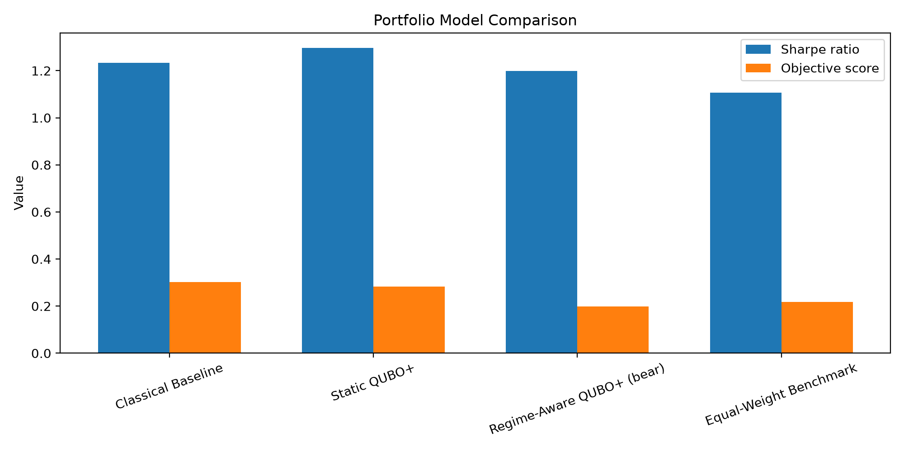

# WISER-Q: Hybrid Quantum-Classical Portfolio Optimization

WISER-Q is a portfolio optimization project that compares classical benchmarks against quantum-inspired QUBO approaches on real market data. The repository includes the original Phase 1 pipeline and the Phase 2 fast out-of-sample backtest with risk, turnover, transaction-cost, reporting, and visualization analysis.

The project is designed as a hybrid quantum-classical portfolio optimization pipeline: classical methods provide transparent benchmarks, while QUBO-based methods model portfolio selection with binary decision variables and penalty terms for practical constraints.

## Project Goal

The goal is to build an optimization pipeline that balances:

- Expected return
- Risk and tail risk
- Turnover
- Transaction costs
- Sector constraints
- Cardinality constraints

The project compares the following portfolio construction approaches:

1. **Classical Baseline:** Brute-force or cardinality-constrained classical optimization.
2. **Static QUBO+:** A quantum-inspired formulation with penalty terms for return, risk, cardinality, transaction cost, and sector constraints.
3. **Regime-Aware QUBO+:** A dynamic version that detects market regime and applies partial rebalancing to reduce friction.
4. **Hybrid:** A risk-adjusted blend of the Quantum and minimum-variance portfolios in the Phase 2 backtest.
5. **Equal-Weight Benchmark:** Uniform allocation across the selected assets.
6. **Minimum-Variance Benchmark:** Allocation focused on minimizing portfolio variance.

## Why This Problem Matters

Portfolio optimization is a practical finance problem where small changes in the objective function or constraints can change the final allocation. In real settings, a model is not useful if it ignores implementation frictions such as transaction costs, turnover, sector limits, and tail risk.

This project is designed to show that quantum-inspired optimization can be made more realistic, interpretable, and competition-ready while remaining comparable with classical portfolio construction methods.

## Phase 1 Setup

Phase 1 uses a small, real-world asset universe:

- 10 U.S. large-cap stocks
- Daily adjusted close prices
- Data range: 2020-01-01 to 2025-01-01
- Budget / cardinality constraint: exactly 4 assets selected
- Sector constraints enforced through hard checks and QUBO penalties

The current experiments use:

`AAPL`, `AMZN`, `GOOGL`, `JNJ`, `JPM`, `KO`, `MSFT`, `NVDA`, `PG`, `XOM`

This is a useful Phase 1 dataset because it is small enough for exact classical benchmarking, but still realistic enough to demonstrate meaningful portfolio behavior.

## Methods

### Classical Baseline

The classical model performs brute-force search over valid 4-asset portfolios and keeps only allocations that satisfy the sector constraints. The selected portfolio is evaluated using:

- Expected return
- Variance
- Volatility
- Sharpe ratio
- Turnover
- Transaction cost
- CVaR where available

### Static QUBO+

The QUBO model encodes portfolio selection as a binary optimization problem. Its objective includes:

- Return reward
- Risk penalty
- Cardinality penalty
- Budget constraint
- Transaction-cost-aware turnover penalty
- Sector penalty

This version is the strongest performance-focused method in the original Phase 1 project.

### Regime-Aware QUBO+

A market regime detector uses rolling return and rolling volatility as a simple market-state proxy. The regime-aware branch then:

- Changes QUBO penalty parameters based on the detected regime
- Applies partial rebalancing instead of fully replacing the old portfolio
- Reduces trading friction in more defensive conditions

This version is the most adaptive and implementation-aware method in the original project.

### Phase 2 Hybrid Backtest

The Phase 2 backtest evaluates Quantum, Classical, Hybrid, Equal Weight, and Minimum Variance strategies using a 70/30 train-test split. Portfolio weights are estimated on the training period and evaluated on unseen test data.

The Hybrid strategy uses a risk-adjusted blend of the Quantum and minimum-variance portfolios. In the fast backtest, it reduced volatility and CVaR relative to Quantum, but produced lower return.

> **Important:** The current Phase 2 result is a fast pipeline check using `QAOA maxiter=5`. It is not the final tuned performance result.

## Phase 1 Results So Far

On the original Phase 1 dataset and parameter settings:

- Static QUBO+ achieves the best Sharpe ratio among the tested methods.
- Classical Baseline is strong on the combined objective score.
- Regime-Aware QUBO+ lowers turnover and transaction cost, but is currently more conservative and needs further tuning.
- The project demonstrates a meaningful trade-off between raw performance, risk-adjusted performance, and implementation frictions.

## Phase 2 Fast Backtest Results

The current fast Phase 2 backtest produced the following results:

| Strategy | Net annualized return | Volatility | Sharpe Ratio | CVaR | Turnover |
| :--- | ---: | ---: | ---: | ---: | ---: |
| **Quantum** | 15.17% | 13.54% | 1.1200 | -1.77% | 1.0000 |
| **Classical** | **25.30%** | 13.76% | 1.8390 | -1.83% | 1.0000 |
| **Hybrid** | 13.80% | 11.73% | 1.1767 | -1.54% | 1.0000 |
| **Equal Weight** | 24.13% | **11.63%** | **2.0754** | -1.57% | 1.0000 |
| **Minimum Variance** | 9.11% | 11.28% | 0.8070 | **-1.52%** | 1.0000 |

### Phase 2 Findings

- The Classical strategy achieved the highest net annualized return in this fast backtest.
- The Equal Weight portfolio achieved the highest Sharpe ratio and the lowest volatility.
- The Minimum Variance portfolio achieved the lowest CVaR loss magnitude.
- The Hybrid strategy reduced volatility and CVaR relative to the Quantum strategy, but produced lower return.
- The results are preliminary because the QAOA optimizer was run with `maxiter=5`.

## Visual Results

The repository contains the original Phase 1 visual outputs under `data/processed/` and the Phase 2 backtest figures under `results/figures/`.

### Phase 1 Performance Comparison



### Phase 2 Backtest Figures

The Phase 2 plotting script generates comparison charts for:

- Backtest performance
- Risk and CVaR
- Transaction costs and turnover
- Portfolio weights

The generated files are stored in:

```text
results/figures/
```

## Phase 2 Roadmap and Completed Work

Phase 2 was planned to extend the project with simulated or expanded experiments to test:

- Sensitivity to parameter changes
- Scalability as the number of assets increases
- Robustness under different volatility regimes
- The effect of transaction-cost assumptions

The current Phase 2 implementation adds:

- A train-test backtest workflow
- Net annualized return evaluation
- Volatility and Sharpe ratio comparison
- CVaR and tail-risk evaluation
- Turnover and transaction-cost tracking
- Portfolio-weight export
- Automated Markdown reporting
- Automated figure generation

Further Phase 2 work can include:

- Synthetic market generator
- Larger asset universes
- Sensitivity sweeps over `lambda_risk`, `P_turn`, `P_turn_quad`, and sector penalties
- Runtime comparison between classical and QUBO variants
- More detailed robustness analysis
- Tuned QAOA runs with larger optimization budgets

## Repository Structure

```text
wiser/
├── src/
│   ├── main.py                         # Main Phase 1 execution entry point
│   ├── classical_baseline.py            # Classical, equal-weight, and min-variance baselines
│   ├── config.py                        # Central configuration parameters
│   ├── data_loader.py                   # Yahoo Finance data ingestion and preprocessing
│   ├── feature_engineering.py           # Volatility, momentum, and return features
│   ├── portfolio_copilot.py             # Automated text summary report generator
│   ├── portfolio_math.py                # Financial metrics, returns, and covariance math
│   ├── qubo_integration.py              # Pipeline integration helper
│   ├── qubo_optimizer.py                # QUBO formulation and QAOA optimizer
│   ├── regime_detector.py               # Market regime classification
│   ├── regime_rebalance.py              # Regime-based post-processing and rebalancing
│   ├── cvar_analysis.py                 # VaR and CVaR evaluation
│   ├── plot_results.py                  # Original Phase 1 plotting script
│   ├── backtest.py                      # Phase 2 train-test backtest workflow
│   └── plot_backtest.py                 # Phase 2 backtest visualization script
├── data/
│   └── processed/
│       ├── adj_close.csv
│       ├── baseline_results.csv
│       ├── comparison_results.csv
│       ├── summary_results.csv
│       └── comparison_chart.png
├── results/
│   ├── figures/                         # Phase 2 generated charts
│   ├── phase2_backtest_metrics.csv     # Phase 2 performance and risk metrics
│   ├── phase2_backtest_weights.csv     # Phase 2 portfolio weights
│   └── phase2_backtest_report.md       # Automated Phase 2 Markdown report
├── README.md
└── requirements.txt
```

## How to Run

Install dependencies first:

```bash
pip install -r requirements.txt
```

Run the original full pipeline:

```bash
python src/main.py
```

Run the Phase 2 backtest:

```bash
python src/backtest.py
```

Generate the Phase 2 charts:

```bash
python src/plot_backtest.py
```

The original pipeline will:

- Download or load price data
- Compute returns and covariance
- Run the classical baseline
- Run the static QUBO+
- Run the regime-aware QUBO+
- Save processed results in `data/processed/`
- Generate a comparison chart

The Phase 2 workflow additionally:

- Creates train-test portfolio evaluations
- Calculates return, volatility, Sharpe ratio, CVaR, and turnover
- Saves metrics and portfolio weights under `results/`
- Generates backtest charts under `results/figures/`
- Writes an automated Markdown report

## Main Outputs

The original pipeline saves:

```text
data/processed/adj_close.csv
data/processed/baseline_results.csv
data/processed/comparison_results.csv
data/processed/summary_results.csv
data/processed/comparison_chart.png
```

The Phase 2 workflow saves:

```text
results/phase2_backtest_metrics.csv
results/phase2_backtest_weights.csv
results/phase2_backtest_report.md
results/figures/
```

## Limitations

- Phase 1 uses a small asset universe, so scalability is not yet demonstrated.
- The regime detector is deliberately simple and rule-based.
- The regime-aware version currently improves turnover and friction, but still needs parameter tuning to outperform the static QUBO on every metric.
- The Phase 2 fast backtest uses a limited QAOA optimization budget with `maxiter=5`.
- The reported fast-backtest results should not be treated as final tuned performance claims.
- The QUBO solver is simulation-based, not hardware-executed.
- Results depend on the selected data period, parameter settings, transaction-cost assumptions, and random or solver-specific behavior.

## Future Work

- Add larger Phase 2 simulation experiments.
- Increase the asset universe size.
- Add sensitivity analysis and runtime scaling plots.
- Improve regime detection with a more advanced model.
- Tune QAOA optimization settings and compare multiple seeds.
- Add walk-forward and repeated out-of-sample validation.
- Explore hardware or hybrid quantum backends.
- Improve transaction-cost and slippage modeling.

## AI Tools Used

Generative AI tools were used for:

- Brainstorming project structure
- Editing and improving README wording
- Code assistance for QUBO and regime-aware pipeline integration
- Helping prepare a clearer competition-oriented narrative
- Assisting with backtest reporting and visualization organization

## References / Credits

Primary references include:

- WISER challenge materials
- QUBO and portfolio optimization literature
- Transaction-cost-aware portfolio optimization research
- Regime-switching portfolio allocation research
- The `yfinance` data source used for market data access

All code, data, and external sources should be credited appropriately in the final submission package.
