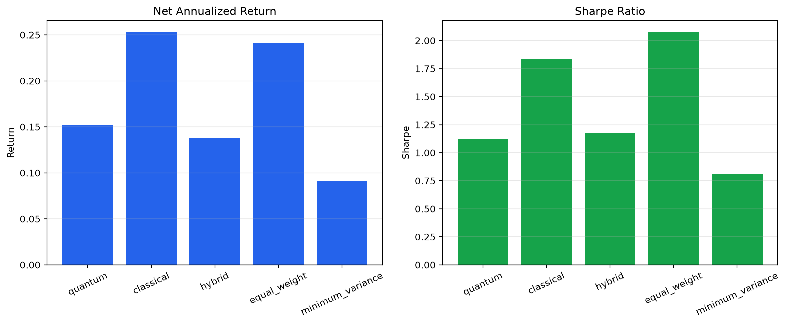
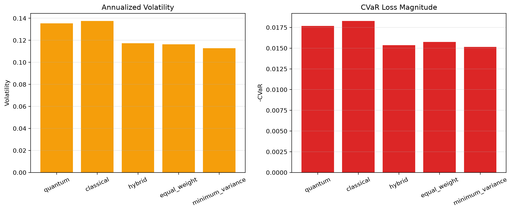
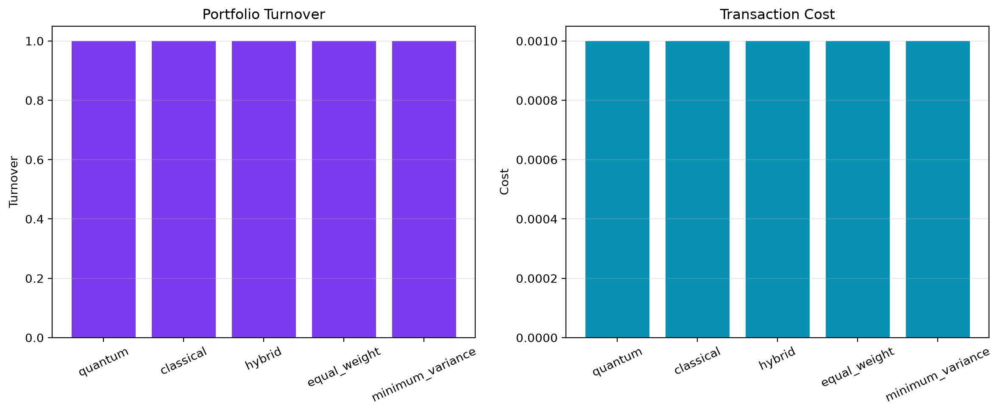
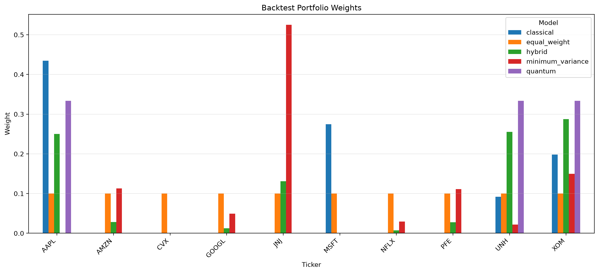

# Phase 2 Backtest Report

## Configuration

- Training ratio: 0.70
- QAOA depth: 2
- QAOA maxiter: 5

## Model comparison

| Model | Net return | Volatility | Sharpe | CVaR | Turnover | Cost |
|---|---:|---:|---:|---:|---:|---:|
| quantum | 15.17% | 13.54% | 1.1200 | -1.77% | 1.0000 | 0.001000 |
| classical | 25.30% | 13.76% | 1.8390 | -1.83% | 1.0000 | 0.001000 |
| hybrid | 13.80% | 11.73% | 1.1767 | -1.54% | 1.0000 | 0.001000 |
| equal_weight | 24.13% | 11.63% | 2.0754 | -1.57% | 1.0000 | 0.001000 |
| minimum_variance | 9.11% | 11.28% | 0.8070 | -1.52% | 1.0000 | 0.001000 |

## Best results

- Best Sharpe: equal_weight (2.0754)
- Highest net annualized return: classical (25.30%)
- Lowest volatility: minimum_variance (11.28%)
- Lowest CVaR loss magnitude: minimum_variance (-1.52%)

## Figures

## Interpretation

The results are based on a single 70/30 train-test split and a fast QAOA configuration. They should be treated as an out-of-sample pipeline check, not as the final performance claim.

The Hybrid strategy differs from the Quantum portfolio and provides a separate risk-adjusted allocation for comparison.